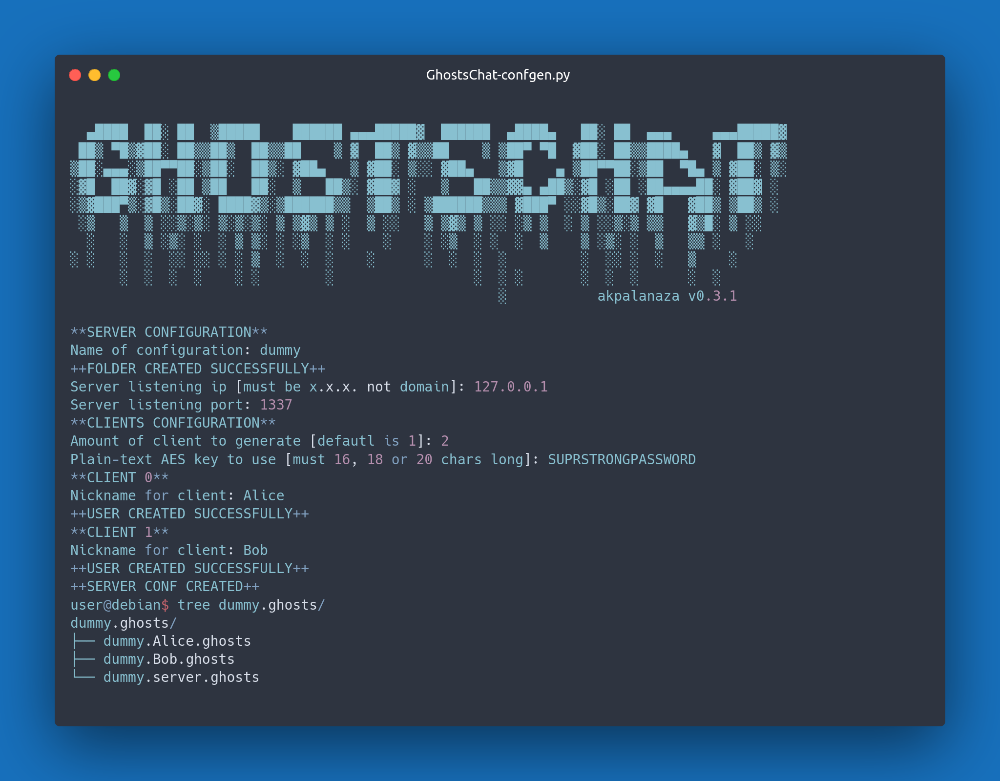

# GhostsChat

> [!WARNING]
Do not fully trust GhostsChat as a secured-confidential messaging app. It's an IRC PoC thing.

GhostsChat is a lightweight chat providing annonymity and simplicity.

## Summary
- [Usage](#Usage)
- [HowItWorks?](#HowItWorks?)


## Usage

First you will need to generate a configuration file for the server and any client you want to have.

You need to use [GhostsChat-confgen.py](./GhostsChat-confgen.py) :



As you can see, currently, you need to type the AES key you want to use, it will be changed in newer version.

After creating configuration files, you should be able to start using GhostsChat.

simply type `python3 GhostsChat-client.py <ghosts-client-conf-file>`.

> [!NOTE]
Currently, server is taking conffile in argument. See --help.

## HowItWorks?

##### Server part is just used to broadcast a message to every connected clients.

The server is untrusted, therefore, it only have access to encrypted data (no access to keys), and it doesn't store it.

##### The client part is more complex.

Similar to the server it doesn't store anything, so wether you quit and reconnect or you weren't connected when the import message arrived, you missed it.

Thus GhostsChat is meant to be used along annother chat app (discord, telegram) so you can bring people for a meeting on GhostsChat.

Client use AES-256-GCM (AES with salt, to simplify) for message encryption and RSA-4096 for signing packets.

Messages are sent with form : 
```python
payload = {
    "nickname" : NICKNAME,
    "time" : TIME,
    "sign" : [int(byte) for byte in bytearray(SIGN)],
    "message" : message
}
```
The `RsaSign()` sign the payload using the SHA-256 hashed message.

After Encryption, payload look like this:

```
[12 bytes of nonce for AES-GCM][Encrypted data (len is multiple of the key len used)]
```

For bigger messages (and for file transfer in future version), Chunk splitting functions are used to breakdown the data to send in smaller 4096 bytes chunks.


> [!WARNING]
Remember, do not fully trust GhostsChat as a secured-confidential messaging app. It's an IRC PoC thing.
